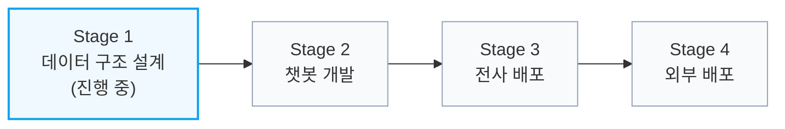
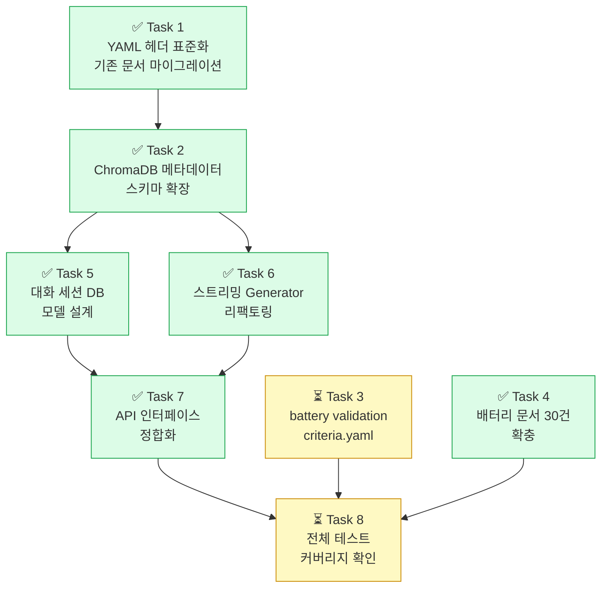
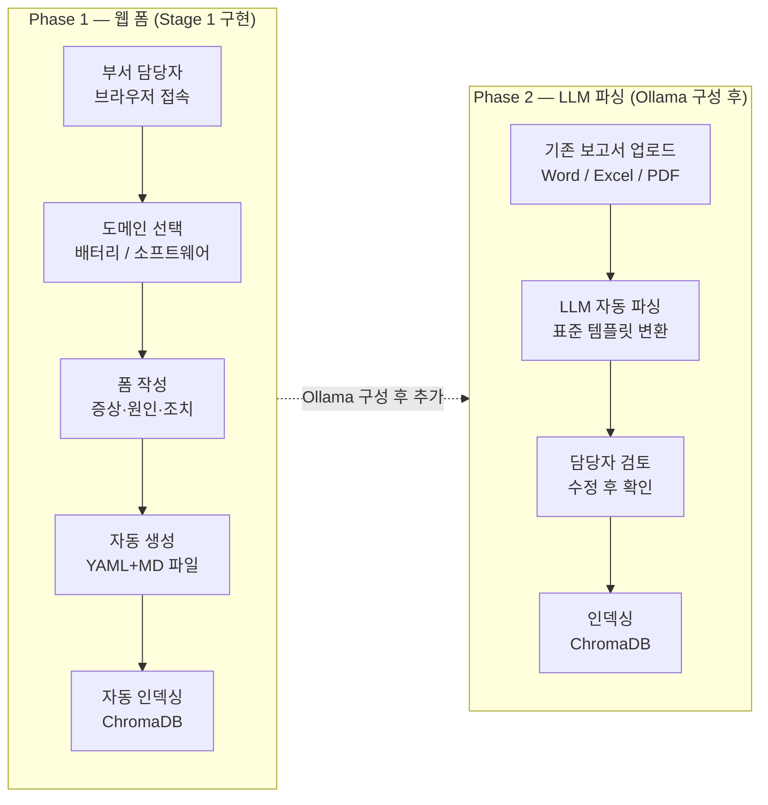
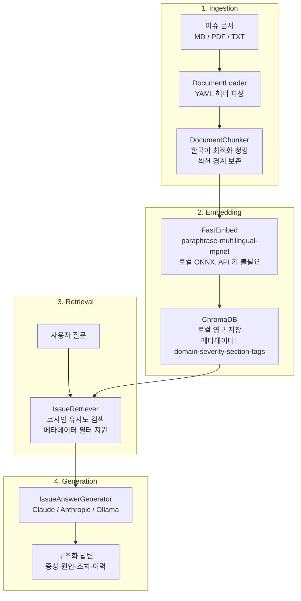

# Issue Pipeline

사내 버그·이슈 문서를 RAG(Retrieval-Augmented Generation)로 처리하는 지식 파이프라인.  
버그 리포트, 장애 보고서, 배터리 도메인 이슈를 벡터 DB에 인덱싱하고 Claude AI가 자연어 답변을 생성한다.

> **대외비** — 고객 데이터 및 이슈 문서는 외부 서비스에 업로드하지 않는다.  
> 임베딩(FastEmbed ONNX)과 벡터 DB(ChromaDB)는 완전 로컬 실행이며, LLM은 사내 서버 PC에서 동작한다.

---

## 프로젝트 로드맵



| 단계 | 목표 | LLM | 배포 환경 | 상태 |
|------|------|-----|-----------|------|
| Stage 1 | 데이터 구조 설계·정합화 (LLM 없이) | Claude Agent SDK (개발용) | 로컬 개발 PC | 🔄 진행 중 |
| Stage 2 | 챗봇 개발 (세션·스트리밍·피드백) | Anthropic API | 로컬 개발 PC | ⏳ 예정 |
| Stage 3 | 전사 배포 | Ollama (사내 서버 PC) | 사내 서버 PC | ⏳ 예정 |
| Stage 4 | 외부 배포 | Ollama (외부 서버 PC) | 외부 서버 PC | ⏳ 예정 |

---

## Stage 1 진행 현황



---

## 데이터 수집 시스템 계획 (Option C)

전 부서가 이슈 데이터를 쉽게 제출할 수 있는 데이터 수집 파이프라인.



---

## 시스템 아키텍처



### ChromaDB 메타데이터 스키마

| 필드 | 설명 | 예시 |
|------|------|------|
| `doc_id` | 이슈 문서 ID | `BATTERY-2024-001` |
| `domain` | 도메인 | `battery` / `software` / `incident` |
| `severity` | 심각도 | `critical` / `high` / `medium` / `low` |
| `status` | 상태 | `resolved` / `ongoing` |
| `alarm_code` | 배터리 알람 코드 | `OVP-001` / `OCP-001` |
| `section` | 청크 섹션 | `증상` / `원인` / `조치` / `재발방지` |
| `tags` | 태그 (쉼표 구분) | `overvoltage,cc-charge,sensor` |
| `file_hash` | MD5 해시 (멱등성) | `abc123...` |

---

## 기술 스택

| 구분 | 기술 |
|------|------|
| Language | Python 3.11+ |
| Framework | FastAPI, LangChain |
| LLM | Claude Agent SDK / Anthropic API / Ollama |
| 임베딩 | FastEmbed `paraphrase-multilingual-mpnet-base-v2` (로컬 ONNX) |
| 벡터 DB | ChromaDB (로컬 영구 저장) |
| 패키지 매니저 | uv |

---

## 프로젝트 구조

```
issue-pipeline/
├── src/
│   ├── ingestion/
│   │   ├── document_loader.py   # YAML 헤더 파싱 + 문서 로딩
│   │   └── chunker.py           # 한국어 최적화 청킹
│   ├── embedding/
│   │   └── embedder.py          # FastEmbed + ChromaDB 저장, 섹션 감지
│   ├── retrieval/
│   │   └── retriever.py         # 코사인 유사도 검색, 메타데이터 필터
│   ├── generation/
│   │   └── generator.py         # Claude RAG 답변 생성
│   ├── llm/                     # LLM 백엔드 추상화
│   │   ├── claude_client.py     # Claude Agent SDK
│   │   ├── anthropic_client.py  # Anthropic API
│   │   └── ollama_client.py     # Ollama 로컬 LLM
│   ├── api/
│   │   ├── main.py              # FastAPI 앱
│   │   ├── alarm_router.py      # 배터리 알람 수신
│   │   └── qa_router.py         # QA 3단계 파이프라인
│   ├── qa/                      # QA 파이프라인 (3단계)
│   │   ├── elaboration.py       # Stage 1: 이슈 구체화
│   │   ├── feasibility.py       # Stage 2: 테스트 가능성 판단
│   │   └── report_generator.py  # Stage 3: Markdown 리포트 생성
│   ├── pipeline.py              # 파이프라인 오케스트레이터
│   ├── config.py                # 환경변수 기반 설정
│   └── logger.py                # 구조화 로깅
├── data/
│   ├── raw/                     # 이슈 문서 (BATTERY-*, BUG-*, INCIDENT-*)
│   ├── chroma_db/               # ChromaDB 벡터 저장소 (자동 생성)
│   ├── qa_reports/              # QA 리포트 출력
│   └── config/
│       └── validation_criteria.yaml
├── docs/
│   ├── issue-template-battery.md   # 배터리 이슈 작성 가이드
│   ├── issue-template-software.md  # 소프트웨어 이슈 작성 가이드
│   └── superpowers/
│       ├── specs/               # 설계 문서
│       └── plans/               # 구현 계획
├── scripts/
│   ├── index_documents.py       # 문서 인덱싱 CLI (--mode add|update)
│   ├── start_server.py          # FastAPI 서버 시작
│   └── query_cli.py             # 쿼리 테스트 CLI
└── tests/
```

---

## 설치 및 실행

### 1. 의존성 설치

```bash
uv sync --extra dev
```

### 2. 환경변수 설정

```bash
cp .env.example .env
```

LLM 백엔드 선택:

```bash
# Claude Agent SDK (Claude Code 환경, 기본값)
LLM_BACKEND=claude

# Anthropic API (API 키 필요)
LLM_BACKEND=anthropic
ANTHROPIC_API_KEY=sk-ant-...

# Ollama 로컬 LLM (Stage 3~4, 사내 서버 PC)
LLM_BACKEND=ollama
OLLAMA_BASE_URL=http://localhost:11434
OLLAMA_MODEL=qwen2.5:7b
```

### 3. 문서 인덱싱

```bash
# 신규 문서 추가
uv run python scripts/index_documents.py

# 기존 문서 수정 후 재인덱싱
uv run python scripts/index_documents.py --mode update
```

### 4. 서버 실행

```bash
uv run python scripts/start_server.py --reload
# → http://localhost:8000/docs
```

### 5. 쿼리 테스트

```bash
uv run python scripts/query_cli.py "DB 연결 풀 고갈 원인은?"
```

---

## API 엔드포인트

| 메서드 | 경로 | 설명 |
|--------|------|------|
| GET | `/health` | 서버 상태 확인 |
| GET | `/api/v1/stats` | 인덱스 통계 |
| POST | `/api/v1/query` | RAG 질문 답변 |
| POST | `/api/v1/search` | 유사 문서 검색 (LLM 없음) |
| POST | `/api/v1/index` | 문서 인덱싱 트리거 |
| POST | `/api/v1/qa/elaborate` | QA Stage 1: 이슈 구체화 |
| POST | `/api/v1/qa/feasibility` | QA Stage 2: 테스트 가능성 판단 |
| POST | `/api/v1/qa/report` | QA Stage 3: 리포트 생성 |
| POST | `/api/v1/alarm/ingest` | 배터리 알람 수신 및 처리 |
| POST | `/api/v1/chat/sessions` | 대화 세션 생성 |
| GET  | `/api/v1/chat/sessions` | 세션 목록 조회 |
| GET  | `/api/v1/chat/sessions/{id}` | 세션 조회 |
| DELETE | `/api/v1/chat/sessions/{id}` | 세션 삭제 |
| GET  | `/api/v1/chat/sessions/{id}/messages` | 메시지 목록 |
| POST | `/api/v1/chat/sessions/{id}/stream` | SSE 스트리밍 질문 |
| GET  | `/submit` | 이슈 등록 웹 폼 |

---

## 이슈 문서 작성 가이드

표준 YAML 헤더 필수. 템플릿: [`docs/issue-template-battery.md`](docs/issue-template-battery.md), [`docs/issue-template-software.md`](docs/issue-template-software.md)

```yaml
---
id: BATTERY-2024-001        # 또는 BUG-YYYY-NNN / INCIDENT-YYYY-NNN
domain: battery             # battery | software | incident
severity: critical          # critical | high | medium | low
status: resolved            # resolved | ongoing | investigating
alarm_code: OVP-001         # 배터리 알람 코드 (소프트웨어는 빈 문자열)
tags: [overvoltage, cc-charge]
created_at: 2024-08-12
resolved_at: 2024-08-13
---
```

파일명 규칙: `BATTERY-2024-001_brief_description.md`

---

## 테스트

```bash
# 전체 테스트
uv run pytest tests/ -v

# 커버리지 포함
uv run pytest tests/ --cov=src --cov-report=term-missing
```
