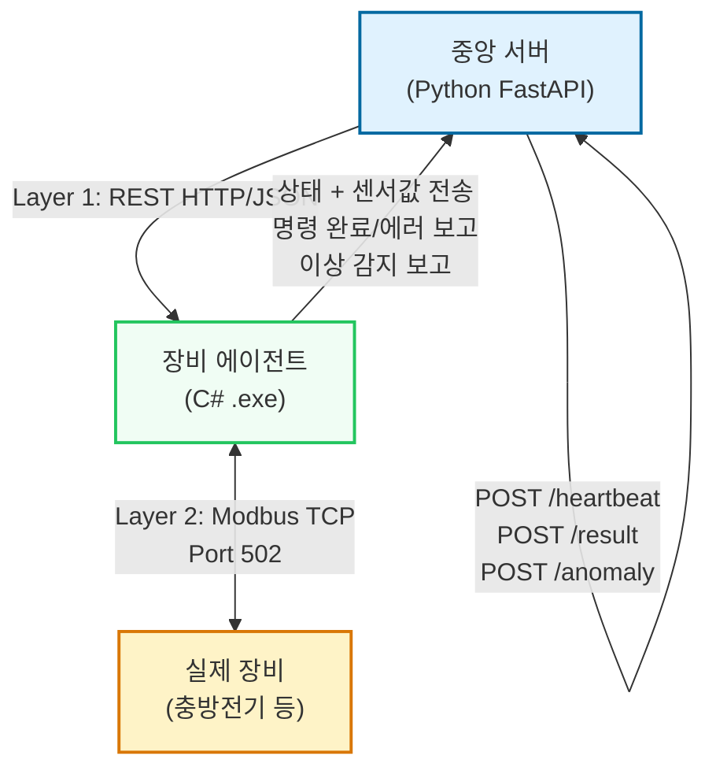

# 장비 제어 시스템 협업 프로토콜 명세

**작성일:** 2026-05-15  
**문서 버전:** v1.0  
**적용 범위:** 중앙 서버(Python) ↔ 장비 에이전트(C#) ↔ 실제 장비(Modbus TCP)

---

## 1. 시스템 개요

장비 제어 시스템은 3계층으로 구성되어 있으며, 각 계층 간 표준화된 프로토콜을 통해 통신한다.

### 구성 요소

| 계층 | 구성 | 역할 |
|------|------|------|
| **서버 계층** | 중앙 서버 (Python FastAPI) | 명령 발행, 상태 모니터링, 데이터 수집 |
| **에이전트 계층** | 장비 에이전트 (C# .exe) | 서버와 장비 간 중개, 안전 감시, 임계값 판단 |
| **장비 계층** | 실제 장비 (충방전기, 온도챔버 등) | Modbus TCP 프로토콜로 제어받는 하드웨어 |

---

## 2. 통신 레이어 아키텍처



### 통신 흐름

```
중앙 서버                              장비 에이전트                   실제 장비
    │                                      │                            │
    ├─────── POST /execute ─────────────>  │                            │
    │        (charge command)               ├─ Modbus FC=06 ───────────>│
    │                                      │    (start register write)   │
    │        ◄─ {status: started} ────────┤                            │
    │                                      │                            │
    │◄─ POST /heartbeat (5초마다) ────────│                            │
    │   {device_id, status, temp,V,I}     │◄── Modbus FC=03 ──────────┤
    │                                      │    (read registers)         │
    │                                      │                            │
    │                                      ├─ 임계값 확인              │
    │                                      ├─ 안전 감시                │
    │                                      │                            │
    │◄─ POST /result (완료 시) ───────────┤                            │
    │   {command_id, status: done}        │                            │
    │                                      │                            │
    ├─ 이상 발생 ─────────────────────────>│                            │
    │◄─ POST /anomaly (즉시) ─────────────┤                            │
    │   {anomaly_type, value, threshold}  │                            │
```

---

## 3. Layer 1 — 중앙 서버 ↔ 에이전트 REST API

### 3.1 에이전트가 제공하는 엔드포인트 (중앙 서버 → 에이전트)

중앙 서버는 다음 엔드포인트를 통해 에이전트를 제어한다.

#### POST /execute
명령을 에이전트에 전달하여 실행을 시작한다.

**Request:**
```json
{
  "command_id": "cmd-uuid-001",
  "command_type": "charge",
  "device_id": "CHG-A-01",
  "params": {
    "target_voltage": 4.2,
    "current_limit": 2.0
  }
}
```

| 필드 | 타입 | 설명 | 필수 |
|------|------|------|------|
| command_id | string (UUID) | 명령 고유 ID (추적용) | ✓ |
| command_type | string | charge, discharge, measure, reset (4.6 참조) | ✓ |
| device_id | string | 장비 ID (CHG-A-01, TEMP-B-02 등) | ✓ |
| params | object | 명령별 파라미터 | ✓ |

**Response (성공):**
```json
{
  "status": "started",
  "command_id": "cmd-uuid-001",
  "message": "Charge command queued"
}
```

**Response (실패 예):**
```json
{
  "status": "error",
  "command_id": "cmd-uuid-001",
  "error_code": "DEVICE_OFFLINE",
  "message": "Device CHG-A-01 not responding"
}
```

---

#### POST /pause
실행 중인 명령을 일시 정지한다.

**Request:**
```json
{
  "command_id": "cmd-uuid-001"
}
```

**Response:**
```json
{
  "status": "paused",
  "command_id": "cmd-uuid-001"
}
```

---

#### POST /resume
일시 정지된 명령을 재개한다.

**Request:**
```json
{
  "command_id": "cmd-uuid-001"
}
```

**Response:**
```json
{
  "status": "resumed",
  "command_id": "cmd-uuid-001"
}
```

---

#### POST /estop
비상 정지. 모든 장비를 즉시 안전한 상태로 전환한다.

**Request:**
```json
{
  "device_id": "CHG-A-01"
}
```

**Response:**
```json
{
  "status": "estop_triggered",
  "device_id": "CHG-A-01",
  "timestamp": "2026-05-15T07:32:11Z"
}
```

---

#### POST /reset
에이전트의 상태를 초기화한다 (에러 해제, 내부 상태 리셋).

**Request:**
```json
{
  "device_id": "CHG-A-01"
}
```

**Response:**
```json
{
  "status": "reset_complete",
  "device_id": "CHG-A-01"
}
```

---

#### GET /status
현재 장비 및 에이전트 상태를 조회한다.

**Response:**
```json
{
  "agent_status": "ready",
  "devices": [
    {
      "device_id": "CHG-A-01",
      "status": "running",
      "current_command_id": "cmd-uuid-001",
      "temperature": 26.3,
      "voltage": 3.85,
      "current": 2.1,
      "last_heartbeat": "2026-05-15T07:32:11Z"
    },
    {
      "device_id": "TEMP-B-02",
      "status": "idle",
      "current_command_id": null,
      "temperature": 22.0,
      "last_heartbeat": "2026-05-15T07:32:10Z"
    }
  ]
}
```

---

### 3.2 에이전트가 호출하는 엔드포인트 (에이전트 → 중앙 서버)

에이전트는 주기적으로 또는 이벤트 발생 시 중앙 서버로 상태를 보고한다.

#### POST /api/v1/equipment/devices/{id}/heartbeat
장비 상태와 센서값을 주기적으로 전송 (5초마다).

**Request:**
```json
{
  "device_id": "CHG-A-01",
  "status": "running",
  "temperature": 26.3,
  "voltage": 3.85,
  "current": 2.1,
  "soc": 75.5,
  "cycle_count": 42,
  "timestamp": "2026-05-15T07:32:11Z"
}
```

| 필드 | 타입 | 설명 | 단위 |
|------|------|------|------|
| device_id | string | 장비 ID | - |
| status | string | IDLE, READY, CHARGING, DISCHARGING, DONE, ERROR | - |
| temperature | float | 센서 온도 | °C |
| voltage | float | 셀 전압 | V |
| current | float | 충방전 전류 (+충전, -방전) | A |
| soc | float | 충전 상태 (State of Charge) | % |
| cycle_count | int | 충방전 사이클 카운트 | - |
| timestamp | string (ISO 8601) | UTC 타임스탬프 | - |

**Response:**
```json
{
  "status": "received",
  "device_id": "CHG-A-01"
}
```

---

#### POST /api/v1/equipment/commands/{id}/result
명령 완료 또는 에러 발생 시 보고.

**Request (성공):**
```json
{
  "command_id": "cmd-uuid-001",
  "device_id": "CHG-A-01",
  "status": "done",
  "error_message": null,
  "result": {
    "total_charge_time_sec": 3600,
    "final_voltage": 4.2,
    "final_current": 0.05,
    "energy_delivered_wh": 10.5
  },
  "timestamp": "2026-05-15T08:32:11Z"
}
```

**Request (실패):**
```json
{
  "command_id": "cmd-uuid-001",
  "device_id": "CHG-A-01",
  "status": "error",
  "error_message": "Over temperature detected",
  "error_code": "OVER_TEMP",
  "timestamp": "2026-05-15T08:32:11Z"
}
```

| 필드 | 설명 |
|------|------|
| command_id | 원래 명령의 command_id |
| device_id | 장비 ID |
| status | done, error, cancelled |
| error_message | 에러 메시지 (status=error 일 때만 필수) |
| result | 명령 완료 결과 데이터 (status=done 일 때만 포함) |

**Response:**
```json
{
  "status": "received",
  "command_id": "cmd-uuid-001"
}
```

---

#### POST /api/v1/equipment/anomaly
이상 감지 시 즉시 보고 (E-STOP 이전에 전송).

**Request:**
```json
{
  "device_id": "CHG-A-01",
  "anomaly_type": "OVER_TEMP",
  "value": 47.3,
  "threshold": 45.0,
  "action_taken": "estop",
  "occurred_at": "2026-05-15T07:32:11Z",
  "details": {
    "duration_sec": 5,
    "max_value": 48.1
  }
}
```

| 필드 | 설명 | 값 예시 |
|------|------|---------|
| device_id | 장비 ID | CHG-A-01 |
| anomaly_type | 이상 유형 (4.5 참조) | OVER_TEMP, OVER_VOLTAGE 등 |
| value | 측정값 | 47.3 |
| threshold | 기준값 | 45.0 |
| action_taken | 수행된 즉시 조치 | estop, pause, reduce_current |
| occurred_at | 발생 시간 | ISO 8601 |
| details | 추가 정보 | 지속시간, 최대값 등 |

**Response:**
```json
{
  "status": "received",
  "anomaly_id": "anom-uuid-001",
  "server_action": "escalate_alert"
}
```

---

## 4. Layer 2 — 에이전트 ↔ 장비 Modbus TCP

### 4.1 연결 정보

| 항목 | 값 |
|------|-----|
| 포트 | 502 (Modbus TCP 표준) |
| 프로토콜 | Modbus TCP over Ethernet |
| 폴링 주기 | 1초 |
| 타임아웃 | 5초 |
| 재시도 | 3회 (각 1초 대기) |
| Modbus 표준 | Modbus Application Protocol v1.1b3 |

---

### 4.2 레지스터 맵

> **주의**: 아래는 예시 맵이며, 실제 장비 매뉴얼에서 정확한 주소와 데이터 타입을 반드시 확인한 후 적용해야 한다.

#### 읽기 전용 (Holding Registers, Function Code 03)

| 레지스터명 | 주소 (16진) | 데이터 타입 | 스케일 | 설명 | 단위 | 폴링 주기 |
|-----------|----------|----------|--------|------|------|---------|
| 온도 | 0x0001 | INT16 | ÷10 | 현재 온도 센서값 | °C | 1초 |
| 전압 | 0x0002 | UINT16 | ÷1000 | 셀 전압 | V | 1초 |
| 전류 | 0x0003 | INT16 | ÷1000 | 충방전 전류 (+충전, -방전) | A | 1초 |
| 충전량 (Ah) | 0x0004 | UINT16 | ÷100 | 누적 충전량 | Ah | 1초 |
| 장비 상태 코드 | 0x0300 | UINT16 | - | 상태 (4.4 참조) | - | 1초 |
| 에러 코드 | 0x0301 | UINT16 | - | 에러 (4.5 참조) | - | 즉시 |
| Cycle Count | 0x0010 | UINT16 | - | 충방전 사이클 누계 | - | 1초 |
| 배터리 상태(SOC) | 0x0011 | UINT16 | ÷100 | 충전 상태 (State of Charge) | % | 1초 |

#### 쓰기 (Function Code 06, Single Register)

| 레지스터명 | 주소 (16진) | 데이터 타입 | 값 | 설명 |
|-----------|----------|----------|-----|------|
| 충전 시작 | 0x0100 | UINT16 | 목표전압 (mV) | CC-CV 충전 시작 (예: 4200 = 4.2V) |
| 방전 시작 | 0x0101 | UINT16 | 차단전압 (mV) | 정전류 방전 시작 (예: 2800 = 2.8V) |
| 충방전 정지 | 0x0102 | UINT16 | 0x01 | 실행 중인 충방전 정지 |
| 비상 정지 | 0x0200 | UINT16 | 0x01 | E-STOP (즉시 중단) |
| 리셋 | 0x0201 | UINT16 | 0x01 | 에러 해제 + 상태 초기화 |

---

### 4.3 장비 상태 코드

에이전트는 주소 0x0300에서 읽은 값으로 현재 장비 상태를 판단한다.

| 코드 (16진) | 코드 (10진) | 의미 | 에이전트 조치 |
|------------|-----------|------|-------------|
| 0x00 | 0 | IDLE | 대기 (다음 명령 수용 가능) |
| 0x01 | 1 | READY | 준비 완료 (충방전 커맨드 수용 가능) |
| 0x02 | 2 | CHARGING | 충전 중 |
| 0x03 | 3 | DISCHARGING | 방전 중 |
| 0x04 | 4 | DONE | 충방전 완료 |
| 0xFE | 254 | WARNING | 경고 상태 (임계값 근처) |
| 0xFF | 255 | ERROR | 에러 발생 (0x0301 에러 코드 확인) |

---

### 4.4 에러 코드

에이전트는 주소 0x0301에서 읽은 값으로 에러 유형을 판단한다.

| 코드 (16진) | 의미 | 즉시 조치 | 서버 보고 |
|-----------|------|---------|---------|
| 0x00 | NO_ERROR | - | - |
| 0x01 | OVER_VOLTAGE | E-STOP + 0x0201 리셋 | POST /anomaly + alert |
| 0x02 | OVER_CURRENT | E-STOP + 0x0201 리셋 | POST /anomaly + alert |
| 0x03 | OVER_TEMP | E-STOP + 냉각 대기 (30초) 후 0x0201 리셋 | POST /anomaly + escalate |
| 0x04 | UNDER_VOLTAGE | 방전 차단 | POST /anomaly + info |
| 0x05 | COMM_TIMEOUT | 통신 재시도 | POST /anomaly + warn |
| 0x06 | HW_FAULT | E-STOP + 수동 점검 필요 | POST /anomaly + critical |
| 0x07 | CELL_IMBALANCE | 현재 작업 일시 정지 후 점검 | POST /anomaly + warn |

---

## 5. 안전 임계값 정의

에이전트는 다음 임계값을 로컬에서 감시하며, 조건 위반 시 즉시 E-STOP을 실행한다.

| 항목 | 정상 범위 | 경고 레벨 | 즉시 E-STOP |
|------|---------|---------|----------|
| **온도** | 0 ~ 40°C | 40 ~ 45°C | > 45°C |
| **충전 전압** | 0 ~ 4.2V | 4.2 ~ 4.25V | > 4.25V |
| **방전 전압** | 2.8 ~ 4.2V | 2.8 ~ 3.0V | < 2.8V |
| **전류** | 0 ~ 2.5A | 2.5 ~ 3.0A | > 3.0A |
| **SOC** | 0 ~ 100% | 95 ~ 100% (충전 중) | - |

> **중요**: 이 값들은 **반드시 실제 장비 스펙에 맞게 재정의**해야 한다.  
> 제조업체 매뉴얼에서 절대 최대값(Absolute Maximum Rating)을 확인하여 보수적인 마진(예: -5%)을 설정할 것.

---

## 6. command_type 목록

중앙 서버에서 에이전트에게 전달할 수 있는 명령 유형.

| command_type | 설명 | 필수 params | 응답 시간 |
|-------------|------|-----------|---------|
| **charge** | CC-CV 충전 | target_voltage (V), current_limit (A) | 3600초 (1시간) |
| **discharge** | 정전류 방전 | cutoff_voltage (V), current (A) | 1800초 (30분) |
| **measure** | 센서값 측정 (한 번) | - | 1초 |
| **reset** | 상태 초기화 + 에러 해제 | - | 5초 |

### 명령 예시

**charge 명령:**
```json
{
  "command_id": "cmd-uuid-001",
  "command_type": "charge",
  "device_id": "CHG-A-01",
  "params": {
    "target_voltage": 4.2,
    "current_limit": 2.0
  }
}
```

**discharge 명령:**
```json
{
  "command_id": "cmd-uuid-002",
  "command_type": "discharge",
  "device_id": "CHG-A-01",
  "params": {
    "cutoff_voltage": 2.8,
    "current": 1.0
  }
}
```

---

## 7. 에이전트 로컬 안전 감시 알고리즘

에이전트는 다음 흐름으로 각 폴링 주기(1초)마다 안전을 감시한다.

```
1. Modbus FC=03으로 모든 레지스터 읽기
   ├─ 온도, 전압, 전류, 상태 코드, 에러 코드
   │
2. 읽은 값이 E-STOP 임계값을 초과하는가?
   ├─ YES → E-STOP 실행 (0x0200 = 0x01 쓰기)
   │       → POST /anomaly 보고
   │       → 상태: ERROR
   │
3. 상태 코드 = ERROR 인가? (0xFF)
   ├─ YES → 에러 코드 확인 (0x0301)
   │       → 에러 유형별 조치
   │       → POST /anomaly 보고
   │
4. 임계값이 아니고 에러가 아닌가?
   ├─ YES → POST /heartbeat로 중앙 서버에 보고
   │       → 정상 동작 계속

5초마다 (또는 변화 감지 시)
   → GET /status로 중앙 서버에 현재 상태 전송
```

---

## 8. 통신 재시도 정책

### HTTP 요청 재시도 (중앙 서버 ↔ 에이전트)

| 상황 | 재시도 횟수 | 대기 시간 | 최대 대기 |
|------|-----------|---------|---------|
| 연결 타임아웃 | 3회 | 1초 * (2^n) | 8초 |
| HTTP 5xx | 3회 | 1초 * (2^n) | 8초 |
| HTTP 429 (Rate Limited) | 5회 | 5초 (고정) | 30초 |
| DNS 실패 | 1회 | - | - |

### Modbus TCP 재시도 (에이전트 ↔ 장비)

| 상황 | 재시도 횟수 | 대기 시간 |
|------|-----------|---------|
| Read 타임아웃 | 3회 | 1초 |
| CRC 체크섬 에러 | 3회 | 0.5초 |
| Modbus Exception | 1회 (에러 분석 후) | - |

---

## 9. 데이터 검증 규칙

### 중앙 서버 → 에이전트

- `command_id`: UUID v4 형식, 중복 불가
- `command_type`: 4.6에 정의된 값만 수용
- `device_id`: 영숫자 + 하이픈만 허용 (정규식: `^[A-Z0-9\-]+$`)
- `params`: command_type별 필수 필드 모두 있어야 함
- target_voltage: 0 ~ 5.0V (실제 장비 범위 확인 필수)
- current_limit: 0 ~ 3.0A (실제 장비 범위 확인 필수)

### 에이전트 → 중앙 서버

- `device_id`: device_id 등록 여부 확인
- `timestamp`: ISO 8601 형식, 서버 시간과 편차 < 10분
- `temperature`, `voltage`, `current`: 물리적 범위 확인
  - 온도: -20 ~ 80°C
  - 전압: 0 ~ 5.0V
  - 전류: -3.0 ~ 3.0A

---

## 10. 로깅 및 감시

### 에이전트 로그 레벨

| 레벨 | 기록 항목 | 예시 |
|------|---------|------|
| **ERROR** | E-STOP, 장비 연결 실패, Modbus 에러 | `ESTOP triggered: OVER_TEMP at 2026-05-15T07:32:11Z` |
| **WARN** | 임계값 접근, 통신 타임아웃, 재시도 | `Temperature approaching threshold: 44.5°C (limit: 45.0°C)` |
| **INFO** | 명령 수신, 상태 변화, 완료 | `Command cmd-uuid-001 completed: charge done in 3600s` |
| **DEBUG** | Modbus 레지스터 읽기/쓰기, 모든 heartbeat | `Read register 0x0001: 263 (26.3°C)` |

### 감시 항목

중앙 서버는 다음을 실시간 모니터링해야 한다:

- 에이전트 heartbeat 응답 부재 (> 10초)
- 장비 heartbeat 부재 (> 15초)
- 비정상적으로 높은 에러율 (> 5% in 1분)
- 명령 완료 지연 (예정된 시간의 2배 이상)

---

## 11. 버전 관리

| 항목 | 버전 | 비고 |
|------|------|------|
| 프로토콜 명세 | v1.0 | 2026-05-15 |
| 적용 에이전트 | C# agent-csharp v1.0+ | - |
| 적용 중앙 서버 | Python issue-pipeline v2.0+ | - |
| Modbus 표준 | Modbus TCP v1.1b3 | IEC 61131-3 |
| HTTP/REST | HTTP/1.1 | RFC 7231 |

### 하위 호환성

- 새 필드가 Request에 추가되는 경우: 기존 에이전트는 무시하고 진행
- Response의 새 필드: 중앙 서버는 존재하지 않을 수 있으므로 선택적 처리
- 기존 필드 삭제: 주요 버전 업그레이드 시에만 (v2.0 이상)

---

## 12. 트러블슈팅 체크리스트

### 에이전트가 중앙 서버에 연결되지 않는 경우

- [ ] 중앙 서버 IP/포트가 에이전트 설정에 올바른가?
- [ ] 방화벽이 HTTP 포트(기본 8000)를 차단하지는 않는가?
- [ ] DNS 해석이 정상인가? (`nslookup` 테스트)
- [ ] 중앙 서버가 실행 중인가? (포트 리스닝 확인)

### 장비가 에이전트에 응답하지 않는 경우

- [ ] Modbus TCP 포트(502)가 열려 있는가?
- [ ] 장비의 네트워크 설정이 올바른가? (IP, 게이트웨이)
- [ ] Modbus 슬레이브 ID가 설정과 일치하는가? (일반적으로 0x01)
- [ ] 장비 전원이 정상인가?
- [ ] 케이블 연결이 안정적인가?

### Heartbeat가 주기적으로 오지 않는 경우

- [ ] 에이전트 폴링 주기가 설정되어 있는가?
- [ ] 중앙 서버의 heartbeat 엔드포인트가 실행 중인가?
- [ ] 네트워크 연결이 불안정하지는 않은가? (packet loss 확인)

### E-STOP이 작동하지 않는 경우

- [ ] 임계값이 올바르게 설정되어 있는가?
- [ ] Modbus 쓰기 권한이 에이전트에 있는가?
- [ ] 장비가 Modbus FC=06 (Single Register Write)을 지원하는가?
- [ ] 0x0200 주소가 실제 장비와 일치하는가?

---

## 참고 자료

- **Modbus TCP 표준**: [Modbus Organization](https://modbus.org/)
- **HTTP REST 설계**: RFC 7231 (HTTP/1.1 Semantics and Content)
- **ISO 8601**: 시간 형식 표준 (예: `2026-05-15T07:32:11Z`)
- **UUID v4**: RFC 4122

---

## 변경 이력

| 버전 | 날짜 | 변경 사항 |
|------|------|---------|
| v1.0 | 2026-05-15 | 초판 작성 (Layer 1, Layer 2, 임계값, command_type) |
